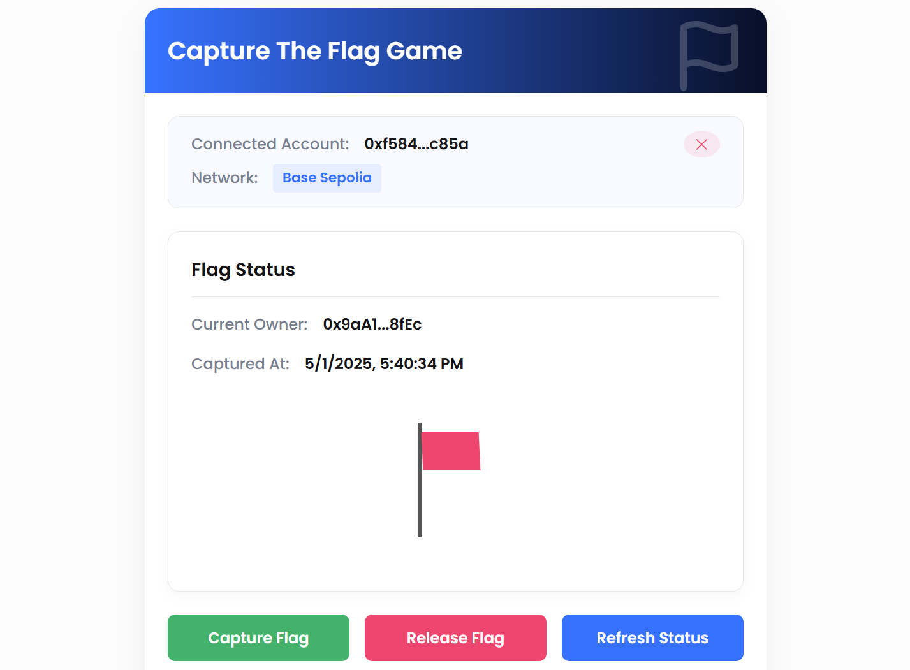

# Capture The Flag DApp

A fullstack decentralized application where users compete to capture a virtual flag on the blockchain. The project includes a Solidity smart contract, React/TypeScript frontend, and Node.js/Express backend.



## Project Overview

This DApp implements a simple game where:
- Users can capture a flag if they don't already own it
- The current flag holder can voluntarily release the flag
- All participants can see who currently holds the flag
- Historical flag captures and releases are tracked

## Demo

Check out the demo video of the application in action:

[Watch Demo Video](https://www.loom.com/share/e61e042006c542c7996ac123e78fdc55?sid=8294bff1-0750-48b7-b1e1-08fa9fd2b5bd)

## Tech Stack

### Smart Contract
- Solidity (v0.8.20)
- Hardhat for development and testing

### Frontend
- React.js with TypeScript
- Ethers.js for blockchain interaction
- CSS for styling

### Backend
- Node.js with Express
- TypeScript
- Event indexing and leaderboard tracking

### Testing
- Hardhat for smart contract tests
- Jest for frontend and backend tests

## Project Structure

```
capture-the-flag-dapp/
├── Contracts/
│   ├── contracts/
│   │   └── CaptureTheFlag.sol
│   ├── test/
│   │   └── CaptureTheFlag.test.js
│   ├── scripts/
│   │   └── deploy.js
│   └── hardhat.config.js
├── frontend/
│   ├── src/
│   │   ├── components/
│   │   │   ├── FlagGame.tsx
│   │   │   ├── WalletConnect.tsx
│   │   │   └──constants.ts
│   │   └── App.tsx
├── backend/
│   ├── src/
│   │   ├── app.ts
│   │   ├── config.ts
│   │   ├── models/
│   │   │   └── types.ts
│   │   ├── routes/
│   │   │   └── flagRoutes.ts
│   │   └── services/
│   │       └── ethService.ts
│   └── tests/
│       └── flag.test.ts
└── README.md
```

## Smart Contract

The smart contract implements the core game logic:

```solidity
// SPDX-License-Identifier: MIT
pragma solidity ^0.8.20;

/**
 * @title CaptureTheFlag
 * @dev A simple contract that allows users to capture and release a flag
 */
contract CaptureTheFlag {
    // Custom errors
    error AlreadyFlagOwner();
    error NotFlagOwner();
    
    // State variables
    address private currentOwner;
    uint256 private lastCaptureTime;
    
    // Events
    event FlagCaptured(address indexed capturer, uint256 timestamp);
    event FlagReleased(address indexed releaser, uint256 timestamp);
    
    function captureFlag() external {
        // Check if sender already owns the flag
        if (msg.sender == currentOwner) {
            revert AlreadyFlagOwner();
        }
        
        // Update state variables (Effects)
        currentOwner = msg.sender;
        lastCaptureTime = block.timestamp;
        
        // Emit event
        emit FlagCaptured(msg.sender, block.timestamp);
    }
    
    function releaseFlag() external {
        // Check if sender is the flag owner
        if (msg.sender != currentOwner) {
            revert NotFlagOwner();
        }
        
        // Store the releaser before updating state
        address releaser = currentOwner;
        
        // Update state variables (Effects)
        currentOwner = address(0);
        lastCaptureTime = 0;
        
        // Emit event
        emit FlagReleased(releaser, block.timestamp);
    }
    
    function getFlagStatus() external view returns (address owner, uint256 captureTime) {
        return (currentOwner, lastCaptureTime);
    }
}
```

## Setup Instructions

### Prerequisites
- Node.js v20+ and npm
- MetaMask browser extension
- Git

### Installation

1. Clone the repository:
```bash
git clone https://github.com/kapildev5262/capture-the-flag.git
cd capture-the-flag
```

2. Install dependencies for all parts of the project:
```bash

# Frontend dependencies
cd frontend
npm install
cd ..

# Backend dependencies
cd backend
npm install
cd ..
```

### Smart Contract Deployment

#### Local Deployment
1. Navigate to the Contracts directory:
```bash
cd Contracts
```

2. Start a local Hardhat node:
```bash
npx hardhat node
```

3. Deploy the contract to the local network:
```bash
npx hardhat run scripts/deploy.js --network localhost
```

4. Test the contract:
```bash
npx hardhat test
```

#### Testnet Deployment (Sepolia)
1. Set up environment variables (create a `.env` file in the Contracts directory):
```
PRIVATE_KEY=your_private_key_here
BASE_SEPOLIA_RPC_URL=your_infura_project_id
ETHERSCAN_API_KEY=your_etherscan_api_key
```

2. Deploy to Sepolia testnet:
```bash
npx hardhat run scripts/deploy.js --network base_sepolia
```

3. Verify the contract on Etherscan:
```bash
npx hardhat verify --network base_sepolia <DEPLOYED_CONTRACT_ADDRESS>
```

4. Update the contract address in `frontend/src/components/constants.ts`:
```typescript
export const Contract_Address = "<DEPLOYED_CONTRACT_ADDRESS>";
```

### Running the Backend

1. Set up environment variables (create a `.env` file in the Contracts directory):
```
PORT=3001


CONTRACT_ADDRESS=contract address
RPC_URL=rpc usrl of network


CORS_ORIGIN=http://localhost:3000
```

2. Start the backend server:
```bash
cd ..
cd backend
npm run dev
```

The server will start at `http://localhost:3001` by default.

### Running the Frontend

1. Start the React development server:
```bash
cd frontend
npm run dev
```

The application will be available at `http://localhost:3000`.

## Running Tests

### Smart Contract Tests
```bash
cd Contracts
npx hardhat test
```

### Backend Tests
```bash
cd backend
npm test
```


## Game Flow

1. Connect your MetaMask wallet to the application
2. If the flag is unclaimed or claimed by someone else, press the "Capture Flag" button
3. If you currently own the flag, you can release it with the "Release Flag" button
4. The UI will display the current flag status and ownership information
5. All flag captures and releases are recorded on the blockchain


## License

This project is licensed under the MIT License - see the LICENSE file for details.
